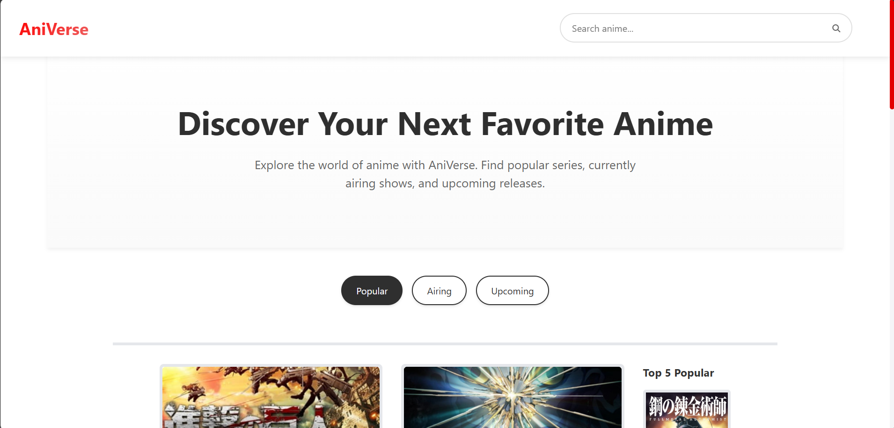
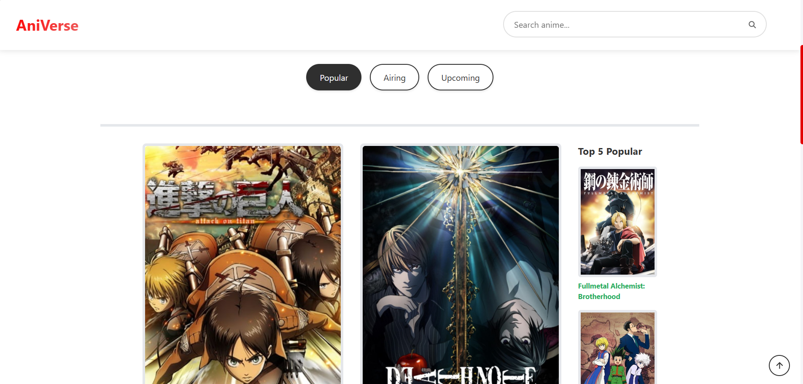
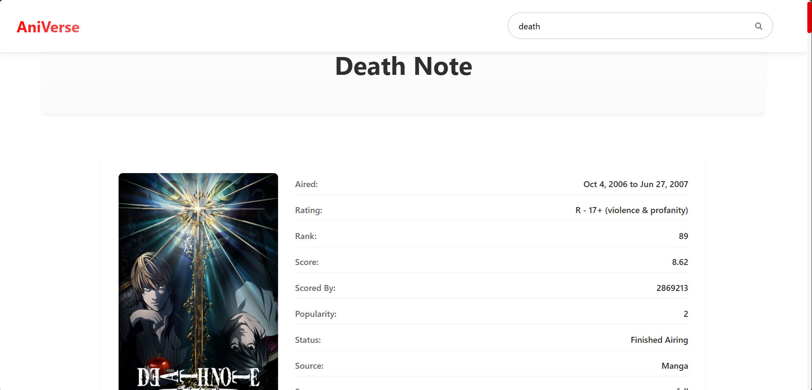
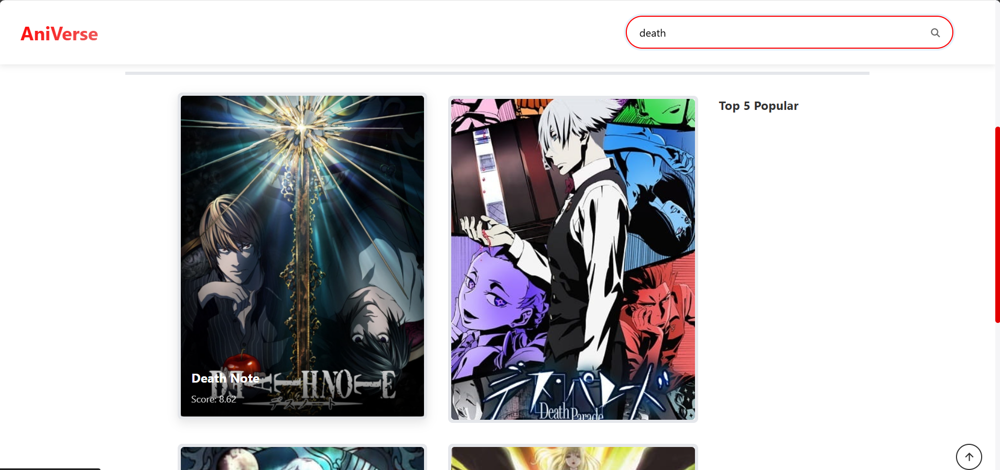

# AniVerse - Anime Database Application

AniVerse is a modern, responsive web application built with React that allows users to explore and discover anime series. The application features a beautiful user interface with smooth animations and provides detailed information about various anime titles.

## Features

- 🎬 Browse popular anime
- 🔍 Search functionality for anime titles
- 📱 Responsive design for all devices
- 🎨 Beautiful UI with smooth animations
- 📊 Detailed anime information
- 🔄 Infinite scroll for seamless browsing
- 🖼️ High-quality image loading with lazy loading

## Screenshots

### Homepage


### Popular Anime Section


### Anime Details


### Search Results


### Mobile View


## Tech Stack

- **Frontend Framework:** React.js
- **Styling:** Styled Components
- **Routing:** React Router DOM
- **Animations:** Framer Motion
- **Icons:** React Icons
- **State Management:** React Context API

## Installation

1. Clone the repository:
```bash
git clone https://github.com/ronakj27/AniVerse.git
cd AniVerse
```

2. Install dependencies:
```bash
npm install
```

3. Start the development server:
```bash
npm start
```

The application will be available at `http://localhost:3000`

## Project Structure

```
src/
├── Components/         # Reusable UI components
├── context/           # Context API for state management
├── App.js            # Main application component
├── index.js          # Application entry point
└── Globalstyle.js    # Global styles and theme
```

## Key Components

- **Popular.js**: Displays popular anime with infinite scroll
- **Sidebar.js**: Navigation and additional information
- **Upcoming.js**: Shows upcoming anime releases
- **Airing.js**: Displays currently airing anime
- **AnimeItem.js**: Individual anime card component

## Features in Detail

### Anime Cards
- Beautiful card design with hover effects
- Lazy loading of images for better performance
- Smooth animations using Framer Motion
- Detailed information display on hover

### Search Functionality
- Real-time search results
- Responsive search interface
- Smooth transitions between search states

### Responsive Design
- Mobile-first approach
- Adaptive grid layout
- Optimized for all screen sizes

## Contributing

1. Fork the repository
2. Create your feature branch (`git checkout -b feature/AmazingFeature`)
3. Commit your changes (`git commit -m 'Add some AmazingFeature'`)
4. Push to the branch (`git push origin feature/AmazingFeature`)
5. Open a Pull Request

## License

This project is licensed under the MIT License - see the LICENSE file for details.

## Acknowledgments

- Jikan API for anime data
- Framer Motion for animations
- React community for amazing tools and libraries

## Contact

Your Name - [@yourtwitter](https://twitter.com/yourtwitter)

Project Link: [https://github.com/ronakj27/AniVerse](https://github.com/ronakj27/AniVerse)
